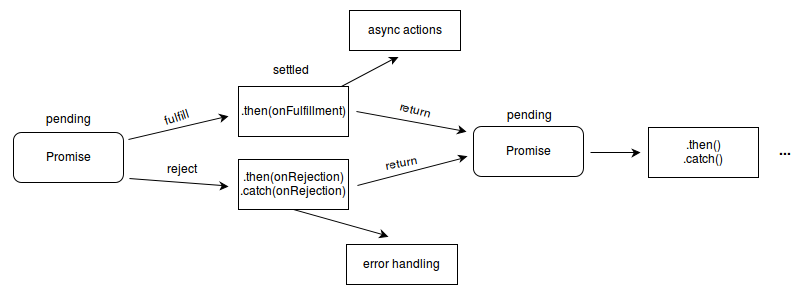

# 控制结构

## if

```javascript
var b = new Boolean(false);
if (b) // this condition evaluates to true
if (b == true) // this condition evaluates to false
```

## while

```javascript
var i = 0;
do {
  i += 1;
  console.log(i);
} while (i < 5);

var n = 0;
var x = 0;
while (n < 3) {
  n++;
  x += n;
}
```

## for

```javascript
let arr = [3, 5, 7];
arr.foo = "hello";

for(let i = 0; i < 3; i++){
    console.log(arr[i]); // logs "0", "1", "2"
}

for (let i in arr) {
   console.log(i); // logs "0", "1", "2", "foo"
}

for (let i of arr) {
   console.log(i); // logs "3", "5", "7"
}
```

## switch

```javascript
switch (fruittype) {
   case "Oranges":
      document.write("Oranges are $0.59 a pound.<br>");
      break;
   case "Apples":
      document.write("Apples are $0.32 a pound.<br>");
      break;
   case "Bananas":
      document.write("Bananas are $0.48 a pound.<br>");
      break;
   case "Cherries":
      document.write("Cherries are $3.00 a pound.<br>");
      break;
   case "Mangoes":
   case "Papayas":
      document.write("Mangoes and papayas are $2.79 a pound.<br>");
      break;
   default:
      document.write("Sorry, we are out of " + fruittype + ".<br>");
}
document.write("Is there anything else you'd like?<br>");
```

## try catch / throw

```javascript
function f() {
  try {
    console.log(0);
    throw "bogus";
  } catch(e) {
    console.log(1);
    return true; // this return statement is suspended
                 // until finally block has completed
    console.log(2); // not reachable
  } finally {
    console.log(3);
    return false; // overwrites the previous "return"
    console.log(4); // not reachable
  }
  // "return false" is executed now  
  console.log(5); // not reachable
}
f(); // console 0, 1, 3; returns false
```

## block

```javascript
{
    var test;
    //xxxx
    console.log(`test${a}`)
}
```

## Promises

Promise 对象有以下几种状态：

* ending：初始的状态，即正在执行，不处于 fulfilled 或 rejected 状态。
* fulfilled：成功的完成了操作。
* rejected：失败，没有完成操作。
* settled：Promise 处于 fulfilled 或 rejected 二者中的任意一个状态, 不会是 pending。



```javascript
function imgLoad(url) {
  return new Promise(function(resolve, reject) {
    var request = new XMLHttpRequest();
    request.open('GET', url);
    request.responseType = 'blob';
    request.onload = function() {
      if (request.status === 200) {
        resolve(request.response);
      } else {
        reject(Error('Image didn\'t load successfully; error code:'
                     + request.statusText));
      }
    };
    request.onerror = function() {
      reject(Error('There was a network error.'));
    };
    request.send();
  });
}

imgLoad('http://test.img').then((response)=>{
    // do sth. when success
}).catch(error=>{
    console.log(error);
})
```