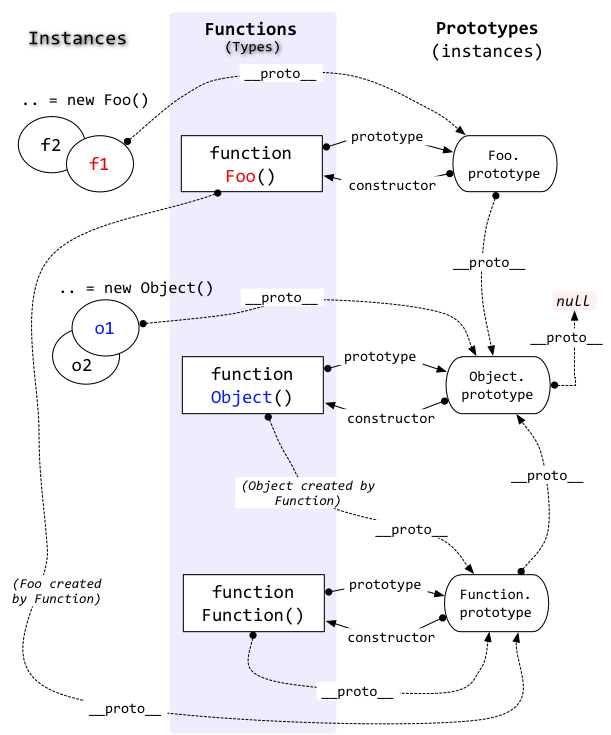

# Prototype

## 普通实例(对象)和函数实例(对象)

首先搞清楚一个概念 : 实例

> 我更喜欢用“实例(instance)”而不是“对象(object)”,当阅读到时,知道是一种东西即可.

简单来说: __实例__ 是通过 *构造函数* *new* 出来的.

Javascript中一切都可以是实例,但是实例之间又有所不同:

```javascript
function Foo(){} // Foo : instance & constructor
let foo = new Foo(); // foo1 : Instance
let Bar = new Function(); //instance 相当于 function Bar(){}
let ob1 = {} // Instance 语法糖,相当于 new Object()
let ob2 = new Object();// Instance

console.log(typeof foo);//foo是Object类型
console.log(typeof ob1);//ob1是Object类型
console.log(typeof ob2);//ob2是Object类型

console.log(typeof Foo);//Foo是Function类型
console.log(typeof Bar);//Bar是Function类型
console.log(typeof Object);//Object 是Function类型
console.log(typeof Date);//Date是Function类型
console.log(typeof Function);//Function是Function类型
// =>
// object
// object
// object
// function
// function
// function
// function
// function
```

1.2.3都比较好理解.
4.5.6.7:这是由于Javascript的定义:所有*函数*(例如上面自定义的Foo,Bar,内置的Object,Date甚至Function本身)都是由```Function```创建的实例.

可以看到正常的创建一个实例的方法为: 调用 new *constructor()*

Javascript 也提供了一些语法糖.可以用来创建实例,例如 ```function Foo(){}``` 或者 ```let obj = {}```,可以简单认为,其本质还是通过new来创建的.

__最终得出的概念是: 实例或者对象就是 ```let foo = new Foo();``` 中通过new后面的Foo(构造函数)构造出来的东西__

同时对象可以分为普通实例和函数实例:

* foo、ob1、ob2 等称为普通实例.通过诸如 Foo()、 Object() 等构造函数构造出来.
* Foo、Bar、Object 等比较特殊,称为函数实例 : 既可以作为构造函数(可以new实例),本身又是个实例,通过构造函数Function构造造出来,例如 ```let Bar =  new Function()``` 或者 ```function Foo(){}```

## 构造函数(函数实例)

当使用 ```let foo = new Foo()``` 的时候 Foo 就是 foo 的构造函数:

>Javascript有个比较奇怪的地方foo是个Foo的实例(foo instanceof Foo),但是foo的类型(typeof foo)却是Object
>
>这个暂时想不明白为什么(可能是弱类型的原因),因此在描述实例的"类型",会尽量避免使用"类型"这一概念,而使用"实例的构造函数".

```javascript
function Foo() {}
let foo1 = new Foo();
let foo2 = new Foo();
console.log(`foo1的构造函数为 : ${foo1.constructor},
foo1和foo2的构造函数相等 : ${foo1.constructor === foo2.constructor},
这是因为foo1,foo2的构造函数都是 Foo : ${foo1.constructor === Foo && foo2.constructor === Foo},
即foo1 instance of Foo : ${foo1 instanceof Foo},
即foo2 instance of Foo : ${foo2 instanceof Foo},
`);

let ob = {};

console.log(`实例都有对应的构造函数:
ob : ${ob.constructor},
Foo : ${Foo.constructor},
Object : ${Object.constructor},
Foo Object同时也作为函数实例,因此它们的构造函数相同,都是Function : ${Foo.constructor === Object.constructor && Object.constructor === Function}
`);
```

## prototype 和 __proto__

很多人搞不清prototype和__proto__的关系,两句话描述 :

* prototype是属于构造函数的,用来访问构造函数的原型
* __proto__是属于实例的,用来访问这个实例的构造函数的原型

> __proto__标准应该为属性:[[Prototype]],但是目前主流浏览器以及Node都为实例实现了getter:__proto__这个 __非标准功能__.

即prototype和__proto__ 都是用来访问一个特殊实例的,这个实例就是某个构造函数的原型(这个原型并不是通过构造函数构造的一个实例).

```javascript
function Foo() {}
let foo = new Foo();
console.log(Foo.prototype);
console.log(foo.__proto__);
console.log(`foo.__proto__ 等于 Foo.prototype(foo由Foo构造):${foo.__proto__ === Foo.prototype}`);
console.log(`foo.__proto__ instance of Foo : ${foo.__proto__ instanceof Foo}`); // 原型并不是通过构造函数构造的一个实例,即不是 new Foo()出来的
console.log(`foo.__proto__ instance of Object : ${foo.__proto__ instanceof Object}`); // 原型是通过 new Object() 构造出来的
console.log(`foo instance of Foo : ${foo instanceof Foo}`); // foo 才是 Foo 的实例
```

下图可以看出__proto__和prototype的区别与联系



## 原型链

Javascript 原型的存在,目的是实现继承.当一个实例上一个属性不存在时,会去__proto__这个实例上去寻找,如果找不到会继续找取__proto__的__proto__去找.... 直到为空(实际如果在没有修改原型链的情况下,最终会找到Object.prototype的__proto__上,Object.prototype.__proto===null)

可以参照上图:

```javascript
function Foo(){}
let foo = new Foo();
console.log(`${foo.__proto__}`); // Foo.prototype
console.log(`${foo.__proto__.__prpto}`); // Foo.prototype.__proto__, Object.prototype
console.log(`${foo.__proto__.__prpto.__proto__}`); // null
```

## 普通对象和原型链

先看一段代码

```javascript
function Foo(ag = 10) {
    this.age = ag;
}
Foo.prototype.name = 'foo.prototype';
Foo.prototype.alert = function() { console.log(`from ${this.name} : age is ${this.age}`); }
let f1 = new Foo(11);
f1.name = 'f1';
let f2 = new Foo(13);
f1.alert(); // 代码1
f2.alert();
// f1.alert2(); // 代码2 f1.alert2 is not a function
// f2.alert2(); // f2.alert2 is not a function
Foo.prototype = { name: 'foo.prototype2', alert: function() { console.log(`来自 ${this.name} : 年龄是 ${this.age}`); } };
Object.prototype.alert2 = function() { console.log(`来自 Object.prototype :  ${this.age} !!!!!!!`); };
let f3 = new Foo(16);
f1.alert(); // 依旧指向旧的prototype 代码3
f2.alert(); // 依旧指向旧的prototypeE
f3.alert(); // 代码4
// 通过 f.__proto__.__proto__ 找到 Object.prototype 上的方法
f1.alert2(); // 代码5
f2.alert2();
f3.alert2();
```

* 代码1: f1 f2 本身没有 alert方法 但是通过原型链 找到 f1.__proto__即 Foo.prototype 上有该方法,因此可以调用
* 代码2: 找到原型链的最后都没有找到 alert 因此不可调用
* 代码3: 这里首先要说明 new 操作做了什么事情: ```let foo = new Foo()``` 相当于三个步骤:

```javascript
let foo = {};
foo.__proto__=Foo.prototype;
Foo.call(foo);
```

因此,foo.__proto__并不会随着 Foo.prototype的改变而改变

* 代码4 : 同上
* 代码5 : 原型链查找

常用对象原型链:

* Array

new Array().\__proto__ => Array.prototype

new Array().\__proto__.\__proto__ = Array.prototype.\__proto__ => Object.prototype

new Array().\__proto__.\__proto__.\__proto__ = Array.prototype.\__proto__.\__proto__ = Object.prototype.\__proto__ => null

* Object

new Object().\__proto__ => Object.prototype

new Object().\__proto__.\__proto__ = Object.prototype.\__proto__ => null

## 函数对象和原型链

函数对象原型链

* Function

function Foo(){}

Foo.\__proto__ => Function.prototype

Foo.\__proto__.\__proto__ = Function.prototype.\__proto__ => Object.prototype

Foo.\__proto__.\__proto__.\__proto__ = Function.prototype.\__proto__.\__proto__ =  Object.prototype.\__proto__ => null

```javascript
function Foo() {}
console.log(Object.getOwnPropertyNames(Foo));
console.log(Object.getOwnPropertyNames(Function.prototype));
console.log(Object.getOwnPropertyNames(Object.prototype));
```

## proto with class

ES6 引入了关键字 class,其本质还是跟原型链有一定关系的.

```javascript
"use strict";

class Polygon {
    constructor(height, width) {
        this.height = height;
        this.width = width;
    }
    get area() {
        return this.height * this.width;
    }
}

class Square extends Polygon {
    constructor(sideLength) {
        super(sideLength, sideLength);
    }
    set sideLength(newLength) {
        this.height = newLength;
        this.width = newLength;
    }
}

var square = new Square(2);

console.log(square.area);

console.log(`Square is : ${typeof Square}`);
console.log(`Polygon is : ${typeof Polygon}`);

console.log(Object.getOwnPropertyNames(square));
console.log(`实例square 的 __proto__ 为类型 Square 的prototype : ${square.__proto__ === Square.prototype}`);
console.log(Object.getOwnPropertyNames(square.__proto__)); // Square.prototype
console.log(`实例square 的 __proto__ 的 __proto__ 为类型 Polygon 的prototype : ${square.__proto__.__proto__ === Polygon.prototype}`);
console.log(Object.getOwnPropertyNames(square.__proto__.__proto__));
```

可以看出, __class__ 其实算是个语法糖,其本质还是通过定义function即构造函数,然后构造对象,而 __extend__ 则是通过设置原型链来实现继承